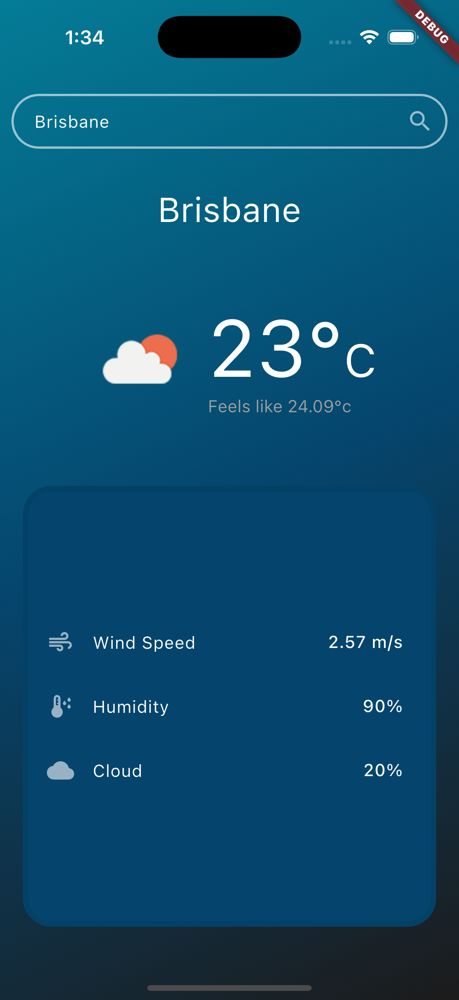

# Weather App Flutter

A Flutter-based weather application that allows users to retrieve real-time weather information for their current location or any city they enter. The app uses the OpenWeather API for weather data and the Geolocator package to fetch the user's location.

## Features

- **Current Location Weather**: Automatically detects and displays the weather based on the user's location.
- **City Weather Search**: Allows users to search for weather information by entering a city name.
- **Detailed Weather Information**: Displays temperature, weather conditions, and other details for the selected location.

## Getting Started

### Prerequisites

- [Flutter SDK](https://flutter.dev/docs/get-started/install)
- An API key from [OpenWeather](https://openweathermap.org/api) to get weather data.

### Installation

1. Clone the repository:
   ```bash
   git clone https://github.com/mohitDhami87/weather_app_flutter.git
   cd weather_app_flutter
   ```

2. Install dependencies:
   ```bash
   flutter pub get
   ```

3. Add your OpenWeather API key:
   - Open the `lib/datasource.dart` file.
   - Replace the `appId` value with your OpenWeather API key:
     ```dart
     String appId = "YOUR_API_KEY_HERE";
     ```

4. Run the app:
   ```bash
   flutter run
   ```

## Project Structure

The main logic of the app is organized within the `lib` folder as follows:

### 1. `home.dart`

The **Home** widget serves as the main screen of the app. Key components of this file include:

- **Search Functionality**: Users can enter a city name in the search bar to get weather information.
- **Automatic Location Detection**: On startup, the app fetches the user’s current location and displays the weather for that location.
- **UI Elements**: Displays weather details such as city name, temperature, and weather description.

### 2. `datasource.dart`

The **Datasource** class handles the API calls to fetch weather data and the current city based on the user's location:

- **getWeatherData(String cityName)**: Fetches weather data for a given city from the OpenWeather API.
- **getCurrentCity()**: Uses the Geolocator package to get the user's current coordinates, converts them to a city name, and returns it. This city name is then used in the `Home` widget to display weather data for the current location.

### 3. `weather_data_provider.dart`

The **WeatherDataProvider** class is a provider that manages the state of weather data within the app:

- **weatherInfo**: A getter to access the weather data throughout the app.
- **fetchData(String cityName)**: Calls `getWeatherData` from `Datasource` to fetch weather information, then updates the state using `notifyListeners()`.

### 4. `weather_data_model.dart`

The **WeatherDataModel** class represents the structure of the weather data. It uses a `fromJson` method to parse JSON data received from the OpenWeather API.

## Screenshots



## Packages Used

- **provider**: State management.
- **http**: To make HTTP requests to the OpenWeather API.
- **geolocator**: To access the user's location for the current city weather.

## Future Enhancements

- **Error Handling UI**: Improve user feedback for API errors, such as invalid city names or connection issues.
- **Additional Weather Data**: Display more detailed weather information (e.g., visibility, dew point, air direction etc).
- **Dark Mode Support**: Add support for dark mode.

## License

This project is licensed under the MIT License.
